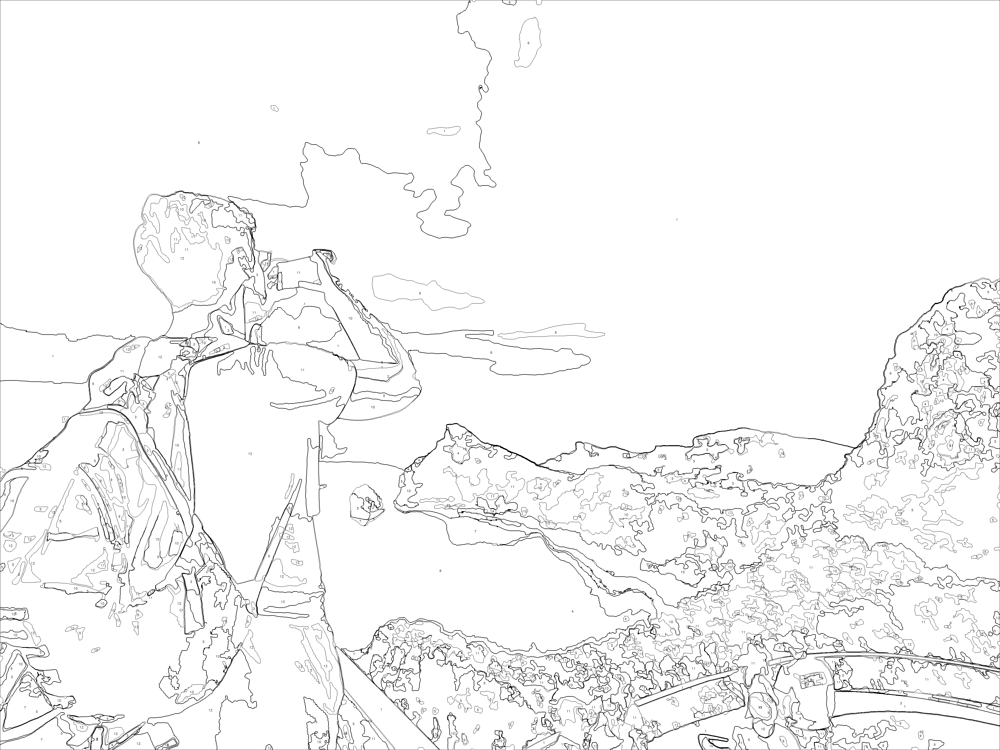

# Paint By Numbers

paint_by_numbers is a small Python tool that allows to convert fotos to paint by number images.

## Installation
Install by:
```bash
pip install git+https://github.com/sebastiankulla/paint_by_numbers.git
```
or if you want to contribute to the development:
```bash
git clone https://github.com/sebastiankulla/paint_by_numbers.git
pip install -e .
```


## Usage
If you want to use your own colors, because you have a color palette with a certain color selection, you can proceed as follows.
The second parameter of the function is a numpy array of the used colors. It has the size (Number of colors x 3)
```python
from paint_by_numbers import create_image_by_predefined_colors
from paint_by_numbers.colors import MARABU_COLORS

create_image_by_predefined_colors('test1.jpg', MARABU_COLORS,output_file='test1_normal.jpg', show_colored=False)
create_image_by_predefined_colors('test1.jpg', MARABU_COLORS,output_file='test1_colored.jpg', show_colored=True)
```




You can also let the tool decide which colors to use for this image. 
For this you only have to specify how many different colors should be used. 
The optimal colors for the image are then determined automatically with the KMeans algorithm.

```python
from paint_by_numbers import create_image_by_kmeans

create_image_by_kmeans('test1.jpg', number_of_colors=18, show_colored=False)
```